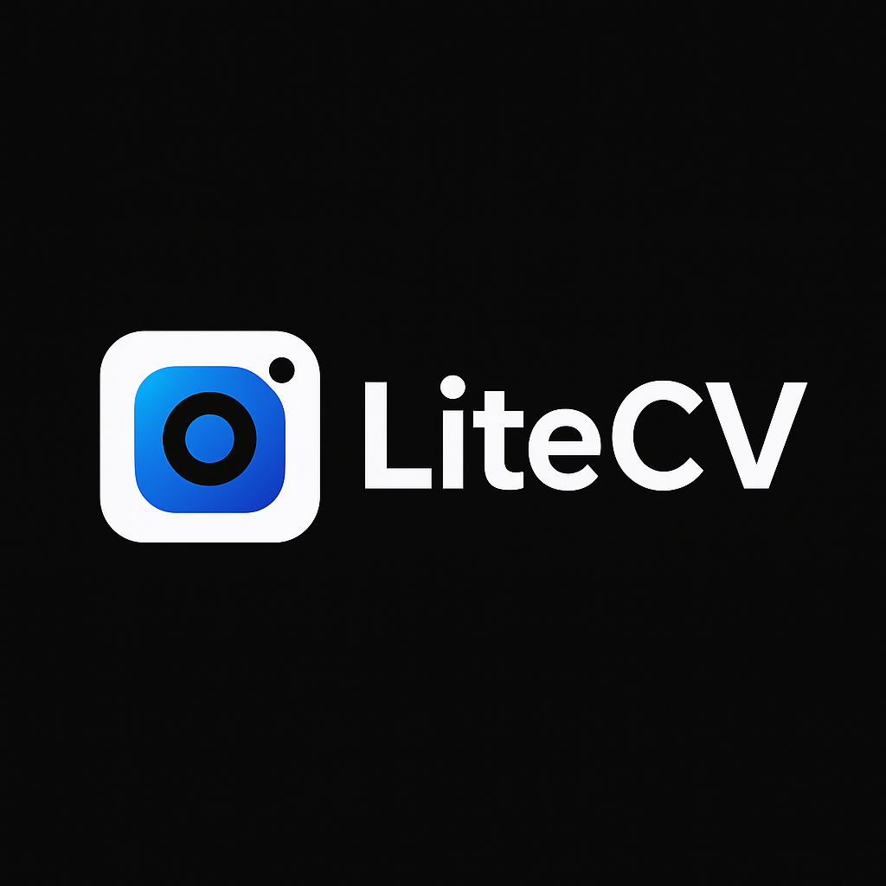

<div align="center">


# LiteCV - Lightweight Computer Vision Library

<p align="center">
  
</p>

<p align="center">
  <strong>A lightweight, fast, and easy-to-use Python computer vision library</strong>
</p>

<p align="center">
  <a href="#features">Features</a> •
  <a href="#installation">Installation</a> •
  <a href="#quickstart">Quick Start</a> •
  <a href="#documentation">Documentation</a> •
  <a href="#examples">Examples</a> •
  <a href="#contributing">Contributing</a> •
  <a href="#license">License</a>
</p>

---

## About

LiteCV is a lightweight Python computer vision library designed for simplicity and performance. Inspired by OpenCV, it provides essential image processing operations, real-time camera capture, and a collection of filters optimized for both desktop and mobile devices. Built on top of industry-standard libraries like `Pillow`, `pygame`, and `numpy`, LiteCV offers a clean, intuitive API for computer vision tasks.

### Why LiteCV?

- **Lightweight**: Minimal dependencies, fast imports
- **Easy to Learn**: Simple, intuitive API inspired by OpenCV
- **Fast**: Optimized for real-time processing
- **Mobile-Friendly**: Designed with mobile devices in mind
- **Well-Documented**: Comprehensive examples and API docs
- **Active Development**: Regularly maintained and updated

---

## Features

### Core Image Operations
- ✅ **Image I/O**: Load, save, and convert images
- ✅ **Resizing**: Resize by pixels or percentage with quality options
- ✅ **Color Conversion**: RGB, Grayscale, and color space transformations
- ✅ **Enhancements**: Brightness, contrast, saturation, sharpness adjustments

### Filters & Effects
- 🎨 **Basic Filters**: Grayscale, Blur, Edges, Sepia
- 🎨 **Advanced Filters**: Cartoon, Sketch, Thermal, Night Vision, Infrared
- 🎨 **Motion Detection**: Real-time motion tracking
- 🎨 **Customizable**: Easy to extend with custom filters

### Drawing & Graphics
- 🖼️ **Shapes**: Draw circles, rectangles, and lines
- 🖼️ **Text**: Render text with custom fonts and sizes
- 🖼️ **Composition**: Concatenate and blend images

### Camera & Real-Time Processing
- 📹 **Live Camera Feed**: Real-time camera capture with pygame
- 📹 **Filter Application**: Apply filters to live video streams
- 📹 **Interactive UI**: Built-in GUI for camera control
- 📹 **Frame Control**: Get individual frames or stream frames

### Advanced Features
- 🔍 **Object Detection**: Basic object detection framework
- 🎬 **Video Processing**: Video frame extraction and processing
- 📊 **NumPy Integration**: Direct array access for advanced operations
- ⚡ **Caching**: Smart caching for performance optimization

---

## Installation

### From Local Repository (Development)

```bash
cd litecv
pip install -e .
```

### From PyPI (When Published)

```bash
pip install litecv
```

### System Requirements

- **Python**: 3.10 or higher
- **Operating System**: Windows, macOS, Linux
- **Camera** (optional): For real-time camera features

### Dependencies

- `pygame>=2.6.1` - Camera capture and real-time display
- `Pillow>=10.0.0` - Image processing
- `numpy>=1.26.0` - Array operations

---

## Quick Start

### 1. Create and Save an Image

```python
from litecv import new_image

# Create a 400x300 pixel image
img = new_image(400, 300, color='lightblue')

# Add text
img.draw_text('Hello LiteCV!', (50, 50), color='darkblue', size=24)

# Add shapes
img.draw_circle((200, 150), 50, color='red', fill='yellow')
img.draw_rectangle((100, 100), (300, 200), color='green', width=2)

# Save the image
img.save('my_image.jpg')
```

### 2. Apply Filters

```python
from litecv import open_image, FilterType, StreamingFilter

# Open an existing image
img = open_image('my_image.jpg')

# Apply a filter
filter = StreamingFilter(FilterType.GRAYSCALE)
result = filter.apply(img.copy())

# Save the result
result.save('my_image_grayscale.jpg')
```

### 3. Real-Time Camera

```python
from litecv import RealTimeCameraApp

# Create and start the camera app
app = RealTimeCameraApp(resolution=(800, 600), camera_resolution=(640, 480))
app.start()

# Use keyboard controls:
# 1-9: Switch filters
# 0: Original (no filter)
# ESC: Exit
```

### 4. Image Manipulation

```python
from litecv import open_image, concatenate, blend_images

# Open images
img1 = open_image('image1.jpg')
img2 = open_image('image2.jpg')

# Resize
img1.resize(320, 240)

# Adjust properties
img1.brightness(1.2)  # 20% brighter
img1.contrast(0.9)    # 10% lower contrast
img1.saturation(1.5)  # 50% more colorful

# Concatenate images
combined = concatenate([img1, img2], direction='horizontal')
combined.save('combined.jpg')

# Blend images
blended = blend_images(img1, img2, alpha=0.5)
blended.save('blended.jpg')
```

---

## Available Filters

LiteCV includes 10+ built-in filters accessible via `FilterType` enum:

| Filter | Description | Use Case |
|--------|-------------|----------|
| `GRAYSCALE` | Convert to grayscale | B&W photography, preprocessing |
| `EDGES` | Edge detection | Object boundary detection |
| `BLUR` | Gaussian blur | Smoothing, privacy masking |
| `SEPIA` | Vintage sepia tone | Retro effects |
| `CARTOON` | Cartoon effect | Artistic rendering |
| `SKETCH` | Pencil sketch | Art simulation |
| `THERMAL` | Thermal imaging | Thermal effect |
| `NIGHT_VISION` | Night vision effect | Low-light simulation |
| `INFRARED` | Infrared imaging | IR effect |
| `MOTION_DETECT` | Motion detection | Movement tracking |

---

## Documentation

### API Reference

See [docs/api.md](docs/api.md) for complete API documentation including:
- `AdvancedLiteImage` class methods
- `StreamingFilter` usage
- `CameraFeed` real-time control
- Utility functions

### Usage Guide

See [docs/usage.md](docs/usage.md) for:
- Detailed usage examples
- Best practices
- Performance optimization tips
- Common workflows

---

## Examples

The `examples/` folder contains production-ready demo scripts:

### Basic Operations
- [basic_image.py](examples/basic_image.py) - Create and draw on images
- [utilities.py](examples/utilities.py) - Image concatenation and blending

### Filters
- [filters_demo.py](examples/filters_demo.py) - Apply all available filters

### Real-Time
- [camera_app.py](examples/camera_app.py) - Interactive camera application

### Advanced
- [object_detection.py](examples/object_detection.py) - Object detection demo
- [video_demo.py](examples/video_demo.py) - Video frame processing

### Branding
- [logo_demo.py](examples/logo_demo.py) - Access logo assets programmatically

### Running Examples

```bash
# Run any example with:
python examples/<filename>.py

# For instance:
python examples/basic_image.py
python examples/filters_demo.py
python examples/camera_app.py
```

---

## Project Structure

```
litecv/
├── litecv/
│   ├── __init__.py          # Package entry point
│   └── _litecv.py           # Core implementation
├── examples/
│   ├── basic_image.py       # Basic operations
│   ├── filters_demo.py      # Filter demonstrations
│   ├── camera_app.py        # Real-time camera
│   ├── object_detection.py  # Detection example
│   ├── utilities.py         # Utility operations
│   ├── video_demo.py        # Video processing
│   ├── logo_demo.py         # Logo utilities
│   └── README.md            # Examples documentation
├── docs/
│   ├── api.md               # Complete API reference
│   └── usage.md             # Usage guide
├── logo/
│   ├── logo.png             # Main logo
│   ├── litecv_logo.svg      # Vector logo
│   └── generate_logo.py     # Logo generation script
├── tests/
│   ├── test_import.py       # Import tests
│   └── test_examples.py     # Example validation
├── README.md                # This file
├── LICENSE                  # MIT License
├── setup.cfg                # Package configuration
└── pyproject.toml           # Build configuration
```

---

## Performance Tips

### For Real-Time Applications

```python
# Use optimize_speed=True for mobile/real-time
img.resize(320, 240, optimize_speed=True)
img.blur(radius=2, optimize_speed=True)

# Cache numpy arrays to avoid repeated conversions
arr = img.to_numpy()  # Cached internally
```

### Memory Optimization

```python
# Work with copies to preserve originals
filtered = img.copy()
filtered.blur(5)

# Load images in batches
images = [open_image(f) for f in file_list[:10]]
```

---

## Troubleshooting

### Camera Not Detected

```python
# Check available cameras
import pygame.camera
pygame.camera.init()
cameras = pygame.camera.list_cameras()
print("Available cameras:", cameras)
```

### Import Errors

Ensure all dependencies are installed:

```bash
pip install pygame pillow numpy
```

### Image Codec Issues

For specific formats, install additional codecs:

```bash
# For WebP support
pip install Pillow-webp
```

---

## Related Projects

### LowMind

LowMind is a companion project providing AI and machine learning utilities. Install it with:

```bash
pip install lowmind
```

Visit the [LowMind documentation](https://pypi.org/project/lowmind/) for more information.

---

## Contributing

We welcome contributions! To contribute:

1. **Fork** the repository
2. **Create** a feature branch (`git checkout -b feature/amazing-feature`)
3. **Commit** your changes (`git commit -m 'Add amazing feature'`)
4. **Push** to the branch (`git push origin feature/amazing-feature`)
5. **Open** a Pull Request

### Development Setup

```bash
git clone https://github.com/yourusername/litecv.git
cd litecv
pip install -e .
python -m pytest tests/
```

### Code Style

- Follow PEP 8
- Use type hints where possible
- Write docstrings for all public methods
- Add tests for new features

---

## Roadmap

- [ ] GPU acceleration with CUDA
- [ ] More object detection models
- [ ] Video file I/O
- [ ] Face detection and recognition
- [ ] Machine learning integration
- [ ] Mobile app support
- [ ] Web interface
- [ ] Performance benchmarks

---

## License

LiteCV is licensed under the MIT License - see [LICENSE](LICENSE) file for details.

```
MIT License

Copyright (c) 2026 LiteCV Contributors

Permission is hereby granted, free of charge, to any person obtaining a copy
of this software and associated documentation files (the "Software"), to deal
in the Software without restriction...
```

---

## Changelog

### Version 0.1.0 (2026-05-03)
- Initial release
- Core image operations
- 10+ built-in filters
- Real-time camera support
- Object detection framework
- Comprehensive documentation
- 8 example scripts

---

## Support

- 📖 [Documentation](docs/)
- 💬 [Issues](https://github.com/yourusername/litecv/issues)
- 📧 Contact: author@example.com

---

## Acknowledgments

- Built with [Pillow](https://python-pillow.org/)
- Camera support via [Pygame](https://www.pygame.org/)
- Array operations with [NumPy](https://numpy.org/)
- Inspired by [OpenCV](https://opencv.org/)

---

<p align="center">
  Made with ❤️ by the LiteCV team
</p>
```
